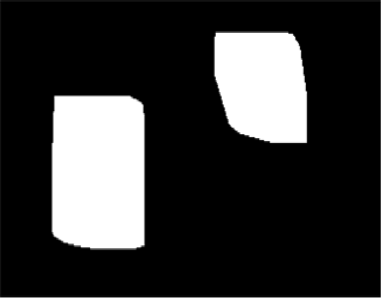

# Video_Vehicle_Counting_and_Classification (영상처리 프로젝트)

##### 1. 프로젝트 정보

\- 프로젝트명 : Video Vehicle Counting and Classification

\- 프로젝트 기간 : 2017. 03 ~ 2017. 06

\- 참여 인원수 : 2명

\- 본인 역할 : 개발 총괄 및 영상처리 개발

\- 프로젝트 설명 : 이 프로젝트는 영상처리를 이용해서 도로에서 차량을 분리하고 카운팅하는 서비스입니다. OpenCV를 이용하여 영상처리를 통해 배경으로부터 차량들을 분리하였고 그 다음에는 C++를 이용하여 Counting 및 Classification을 수행 하였습니다. 

\- 개발 환경 : Visual Studio Community

\- 개발 기술 : OpenCV, C++, 차영상( MOG, MOG2, KNN )

\- 성과 : 처음으로 OpenCV 라이브러리를 사용하게 되면서 어려움을 많이 느끼게 되었습니다. 사소한 것들이라도 그것을 이해하고 구현하는데 많은 시간이 걸렸고 또한 차영상을 끝낸 뒤 Counting 부분이 수많은 시간이 걸렸습니다. 많은 디버깅과 공부, 그리고 도움요청을 통해 완성하였을 때 비록 완벽한 알고리즘, 차영상처리는 아니지만 저만의 방식으로 구현에 성공하였고 지금 이 보고서에 마무리를 짓는 제 자신의 모습이 정말 뿌듯하게 느껴집니다.


##### 2. 설치방법

```
Visual Studio Community import
```


1단계 : 이전 프레임과 현재 프레임을 바탕으로 연산을 진행하면서 배경으로부터 차량을 검출하였습니다. 


2단계 : Threshold을 통해 원하는 값만 뽑아내어 잡음을 제거합니다. 


3단계 : 자동차를 하나의 객체로 만들기 위해 모폴로지 연산을 통하여 객체를 완성했습니다. 


4단계 : Convex Hull을 이용하여 최 외각선을 검출한 뒤 내부에 색상을 채워 최종적으로 객체를 완성했습니다.

​                


5단계 : Labeling 알고리즘을 이용하여 객체에 표시를 하였고 라벨을 통하여 객체에게 사각형을 표시하였습니다.

​                


6단계 : 일정영역을 객체가 통과하게 되면 크기에 맞게 Counting and Classification을 진행합니다.

